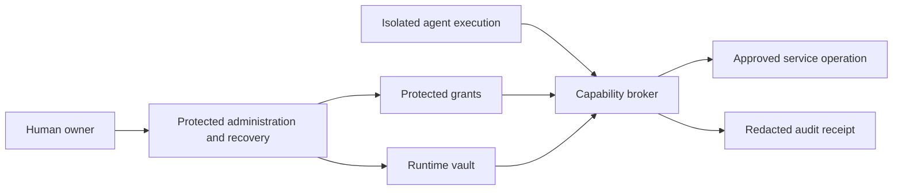

# Owner-controlled secrets and credential authority

Status: **Owner requirements recorded; architecture and backend proposed**,
2026-09-11. Plane **AN-144** tracks this design and review. This document does not
install a vault, migrate credentials, grant access or establish verified security.
Plane owns delivery priorities; the independent-review milestone remains separate.

## 1. Recommendation and owner requirements

Use an established secrets manager for encrypted storage and a protected framework
service to enforce which credential-backed operations agents may perform.
**Recommend self-hosted OpenBao for runtime secrets, behind a capability broker.**
Keep the owner's personal password manager and recovery material outside the
framework's runtime trust domain. The broker is deterministic trusted software,
not an agent deciding whether another agent deserves a password.

The owner requires scoped secrets for framework operations, individual instances
and agents; ultimate human control; no agent ability to change passwords, remove
owner access or obtain secrets outside its grants. This includes the First Builder
and security reviewers. Those requirements are established; the implementation
choices below remain proposals.

**Grant use of an operation, not possession of an account.** A read-only vault
grant prevents editing the vault entry. It does not prevent someone using the
retrieved password to change it on the destination website. Hiding a password
in an unrestricted authenticated browser also leaves the browser able to exercise
the account's privileges. Both storage and destination operations need enforcement.

This extends [existing authority rules](05-human-interaction.md) and the
[protected Builder boundary](08-first-builder.md). No new approval is needed for
each action already covered by an explicit standing grant.

## 2. Findings in the current framework

Reviewed the working tree based on `17af3d4`, including existing uncommitted work.
These findings do not claim that every path is deployed or independently audited.

| Surface | Finding and design consequence |
| --- | --- |
| [Identity](../agent_native/identity.py) and [owner routes](../hermes_cli/web_routers/agent_native.py) | Stable IDs and the private in-process `OWNER` object are useful. The object is not protection against code that can import privileged modules or write the control database. Owner ingress currently uses the dashboard session check. |
| [Plane access](../agent_native/plane_access.py), [reads](../agent_native/plane_reads.py), [writes](../agent_native/plane_writes.py) | Reusable pattern: host-selected scope, fixed operations, revision checks and credentials retained by the adapter. Extend this instead of adding a generic password-reading tool. |
| [Setup contract](../implementation/writer-startup-setup.md), [configuration loader](../agent_native/startup.py), [work planning](../agent_native/writer_planning.py) | Private `plane-setup.json` contains a password/API key. The documented local configuration uses the owner's Plane account, and work planning uses the configured key. Separate privileged provisioning from everyday service access and explicitly preserve owner membership when migrating. |
| [Secret-source contract](../agent/secret_sources/base.py) and [registry](../agent/secret_sources/registry.py) | Hermes already supports Bitwarden Secrets Manager, 1Password and command sources. Their startup fetch into environment-shaped values is not per-agent operation authorization. |
| [Environment loader](../hermes_cli/env_loader.py), [profile scope](../agent/secret_scope.py), [cache](../agent/secret_sources/_cache.py) | Profile context reduces accidental mixing, but fallback, process environment and disk caching exist. Do not inherit these as the managed broker's revocation/security contract. |
| [Host supervisor](../tui_gateway/host_supervisor.py), [managed turn](../agent_native/work_worker.py) | Worker launch includes inherited credentials, and the trusted engine resolves provider credentials. The engine currently remains part of the trusted computing base. |
| [Restricted environment](../agent_native/environment.py) | A Docker path excludes network, automatic mounts and environment forwarding. Its existence does not mean every managed tool uses it. |
| [Repository commands](../agent_native/builder_repository.py), [work dispatch](../agent_native/work_service.py) | `repository_command` permits Python, Node and npm and calls host `subprocess.run`. A working directory and reduced environment do not confine filesystem, process or network access. This is a prerequisite defect for secure coding-agent credentials. |

**Observed probe:** the production repository-command helper, given the repository
as its grant, successfully ran allowed Python that read a synthetic non-secret file
outside that repository in a temporary directory (`returncode=0`). The temporary
file was removed. No personal credential was read. This confirms the filesystem
boundary gap; it does not establish an actual credential leak or replace a future
managed-worker/browser regression test.

Do not attach valuable secrets to this host execution path and call it isolated.
Generated code needs a real OS/container/VM boundary with no access to broker files,
process memory, owner sessions or the control database.

## 3. Custody and scope

The owner is an authenticated human principal. Instance and agent UUIDs select
scope; display names, quoted owner messages, project membership and parentage do
not authenticate access. A framework root agent is never a vault administrator.

| Area | Examples | Who may use it |
| --- | --- | --- |
| Owner and recovery | Owner login, recovery email, MFA recovery codes, vault recovery material, cloud root | Human control only; excluded from normal broker and all agent identities. |
| Framework development/releases | CI tokens, artifact publishing, release-signing authority | Dedicated CI/release identities. The Builder may propose code but cannot retrieve release authority. |
| Instance services | Provider connection, planning integration, storage credentials | Only the specific trusted service that needs each credential. “Instance scoped” does not mean available to every process. |
| Agent/project resources | One repository integration, publishing account or database role | Named agents through explicit permitted operations. Sharing is deliberate. |
| Attempt credentials | Broker session, temporary database lease or delegated service token | Bound to the actual run and destination; invalidated at its end. |

Logical references such as `instance/<uuid>/resource/<uuid>` are identifiers in
protected metadata, not arbitrary vault paths submitted by the model. Values with
different access rights occupy separate vault entries; permission to read one JSON
entry must not expose a more privileged field. Do not disclose unrelated secret
names or existence in listings, errors, autocomplete, logs or agent inspection.

Dev, test and production have distinct identities and enforced storage boundaries.
Cloning an instance gives it a new identity without usable production credentials.
Cross-instance sharing requires explicit owner configuration. There is no
framework-wide super-token distributed to all installations.

Each grant records instance, agent, resource, operations, constraints, current
purpose, validity and delegation. Constraints include account/project, destination,
allowed fields, use/time limits and any required owner decision. Effective access
is the intersection of owner policy, agent grant, current lifecycle, adapter
operation and the destination service's own permissions.

Secret-backed capabilities start **non-delegable**. If the owner enables delegation,
a parent may assign a narrower subset of its held capability to a named child,
with no longer validity or broader target. The host checks the complete chain on
use; source revocation invalidates derived grants. Supervision does not give a
parent read access to an owner-provisioned child-only credential. Replacement does
not copy credentials into the successor's memory or automatically regrant access.

## 4. Protected credential use

Agents request existing domain operations: read a project, create a draft, or
publish to a particular account if granted. They cannot request `get_password`,
supply a vault path, select the actor, or choose arbitrary authenticated URLs and
headers. Extend the scoped adapter pattern without adding a generic core secret tool.

For each call, the trusted runtime binds instance, agent, run, work and action ID.
The broker authenticates the transport, checks current grants/holds, validates the
typed request and records intent before the effect. It obtains only the required
credential, calls the configured service and returns selected business data plus
an attributable receipt. Recheck authority immediately before dispatch and before
releasing sensitive results. Neither a cached prompt nor a cached secret grants access.

Start with host-owned IPC in the existing managed flow. Across machines, use
authenticated workload identities and encrypted transport with short-lived,
audience-bound credentials. TTL alone does not provide immediate revocation:
consult current authority or synchronized revocation state and fail closed when
freshness cannot be established. Caller-supplied identity is never trusted.

Adapters fix destination and service account in owner-controlled configuration,
then allowlist operations, paths and fields. Reject credential-bearing redirects,
arbitrary callbacks, proxy overrides and ambiguous targets. Enforce SSRF/DNS/IP
boundaries, including metadata, host and admin endpoints. Local Plane may use its
exact configured private endpoint; this is not general private-network access.
An allowed domain alone is insufficient because it may also host admin APIs or
attacker-controlled resources. Reconcile uncertain mutations before retrying.

Give adapters separate least-privilege vault identities by service/resource
partition. Ordinary brokers can read assigned entries or obtain approved leases,
but cannot write static secrets, alter policy, mint privileged identities, disable
audit, administer the seal or access owner recovery. Avoid one broker token that
can read every secret. Keep model transport credentials separate from planning.

Plaintext stays only in the trusted component that must use it. Exclude plaintext
disk caches and stale-on-error credential fallback. A short in-memory value cache
still requires a fresh grant check and invalidation on revocation. Do not promise
secure byte erasure of Python strings: bound process lifetime, disable core dumps,
restrict debugging and isolate the process instead.

## 5. Password changes and owner lockout

No agent-facing operation may create, overwrite, rotate, delete, reveal, export
or share vault secrets, administer permissions, enroll authenticators or modify
owner recovery. New-access requests use the existing decision workflow with no
raw value in the message. Only an authenticated owner operation creates the grant.

Destination accounts must be bots/service identities or limited OAuth/App scopes
that exclude password resets, account deletion, owner/member removal, MFA/recovery
changes, API-key administration and ownership transfer. The owner retains a
separate administrator login and recovery channel. Reset links, recovery inboxes,
mail-forwarding rules, session cookies and refresh tokens are also credentials or
account-control capabilities and require the same treatment.

If a legacy site has only one all-powerful login, hiding or encrypting its password
cannot satisfy this requirement. Use a dedicated limited account, a sufficiently
constrained and tested operation adapter, or human-performed steps. Do not grant
unrestricted authenticated browser or shell access under this policy. Some
integrations must remain unavailable until their boundaries are enforceable.

Raw password injection into agent-controlled scripts is excluded from this strict
baseline: even an ephemeral environment variable can be read and exfiltrated.
A future workload-token mode needs a separate explicit product decision, not a
silent fallback when brokering is inconvenient.

Mechanical OAuth refresh and temporary lease issuance/expiry can run inside
trusted software under configured policy. That is not agent permission to change
passwords. Long-lived password rotation remains owner initiated; later automation
needs an explicit owner-approved policy and separate service identity. A security
reviewer can request a scoped capability hold, never rotate passwords or revoke
shared owner credentials.

## 6. Owner control, bootstrap and recovery

The human independently administers the vault, identity provider, hosting, DNS/TLS,
backups and any KMS/HSM. No agent receives those administrative identities. Protect
owner login with phishing-resistant MFA/passkeys and a separately stored recovery
method; require additional authentication for reveal/export and security-policy
edits. Bind ownership to the enrolled principal, never a display name.

Keep secret administration on a protected origin separate from agent previews
and generated content. No agent HTML/JavaScript may run in an owner-session origin.
Use secure cookies, CSRF/origin checks, restrictive content policies and isolated
output rendering. Do not promote a development loopback dashboard token into the
vault administrator credential.

Provision the vault independently of the framework and Plane. Establish owner
access, service identities, audit and recovery before admitting resource use.
Prefer workload identity or OS-protected bootstrap credentials. Any enrollment
secret must be narrowly scoped, short-lived and absent from repositories, command
arguments and agent-readable environments. A vault cannot bootstrap using a
secret obtainable only after that same vault is unlocked.

For OpenBao, use ordinary owner administration for normal operation and reserve
root generation for bootstrap/emergencies. Revoke the initial root token after
setup, as recommended by its [token guidance](https://openbao.org/docs/2.5.x/concepts/tokens/).

Manual Shamir unsealing requires intervention after restart. Auto-unseal delegates
unlocking to a separate trusted device/service and suits unattended restart, but
recovery shares **cannot replace a lost KMS/HSM seal key**. Preserve and test that
dependency separately from vault backups.
[Seal and recovery semantics](https://openbao.org/docs/concepts/seal/).

Recommend auto-unseal for eventual always-on operation, with key administration
outside worker and broker authority. Manual unseal is acceptable for a local
prototype with an explicit restart limitation. Select the provider and threshold
only after hosting and recovery custody are decided. The owner retains all needed
recovery material in separately protected locations; putting every share on one
machine defeats that separation. Recovery must never require agent cooperation.

Provide a human runbook for direct vault access, revoking framework identities,
inspecting/exporting exportable secrets, and restoring on a clean host when the
framework is unavailable. Non-exportable hardware keys remain owner-administered
through their supported backup/recovery procedure. Keep encrypted backups and
audit copies outside agent write/delete rights and actually test restoration.
Portable encrypted exports, if used, need a human-controlled key outside the failed
vault. Owner Stop must remain available during vault or audit outages.

## 7. Revocation, stopping and audit

Revocation first denies new local broker dispatch and increments the grant revision.
Cancel queued actions, invalidate derived capabilities, stop affected execution
and revoke remote leases/sessions where supported. Preserve owner access and
unrelated grants. Retain separate lifecycle/security holds so cadence, an old
answer or restart cannot silently resume work. New grants never revive old handles.

Serialize final local admission with grant changes and record the dispatch boundary.
External services cannot join our database transaction: a request already sent
may still take effect. Show local denial, remote revocation requested/confirmed,
expiry pending and unknown outcome separately. Pausing cannot recall disclosed
data, undo publication or instantly invalidate every remote stateless token.

Prefer short-lived destination credentials where supported. OpenBao manages leases
for dynamic secrets and service tokens; it does not make a copied static password
disappear. [Lease semantics](https://openbao.org/docs/concepts/lease/).
Suspected static-value leakage needs owner-controlled rotation and remote-session
invalidation. Deleting the vault entry alone does not revoke the destination
credential. Cleanup must not replay the original uncertain business action.

Record grant changes, permitted/denied use, secret version/lease IDs, originating
agent/run/action, target, outcome, revocation progress and owner administration.
Exclude values, headers, cookies, reset links and sensitive response bodies. Do
not publish hashes of low-entropy passwords. Correlate broker receipts with vault
events: a vault fetch alone does not explain which operation used a cached value.

Require durable intent recording before privileged effects. Required audit failure
blocks those effects while Stop/recovery remain independent. Protect audit records
against worker editing/deletion with explicit retention and integrity checks.
OpenBao also makes configured audit recording part of serving secrets.
[Security model](https://openbao.org/docs/internals/security/).

Prevent raw values entering prompts, results, transcripts, traces, Plane, memory,
screenshots and outputs at the integration boundary. Redaction and canary tests
are additional checks, not a guarantee against arbitrary exfiltration. Independent
reviewers get scoped redacted evidence and cannot override deterministic denial.

## 8. Backend comparison

Primary documentation reviewed on 2026-09-11. This is a design comparison, not a
penetration test, price quote or claim that a product implements our complete policy.

| Option | Fit and tradeoff |
| --- | --- |
| **OpenBao — recommended runtime backend** | Open-source vault with path policies, dynamic leases and audit, under MPL 2.0. Fits explicit owner custody and service-level access. We operate upgrades, sealing, backup and availability. [Policies](https://openbao.org/docs/concepts/policies/), [license](https://github.com/openbao/openbao/blob/main/LICENSE). |
| **Infisical** | Self-hosted/cloud alternative with machine identities and permission controls. Evaluate its administration workflow; Compose includes PostgreSQL and Redis. Verify the required edition: the vendor documents enterprise features such as SSO separately. [Self-hosting](https://infisical.com/docs/self-hosting/overview), [machine identities](https://infisical.com/docs/documentation/platform/identities/machine-identities). |
| **Bitwarden Secrets Manager** | Read-only machine accounts scoped to projects; Hermes already has an adapter. Practical for static keys and an owner preferring Bitwarden. Match projects to access boundaries and replace managed bulk environment/cache behavior. Confirm deployment features in the selected Secrets Manager plan. [Machine accounts](https://bitwarden.com/help/machine-accounts/), [plans](https://bitwarden.com/help/secrets-manager-plans/). |
| **1Password Service Accounts** | Read-only selected vaults and an existing Hermes adapter make this a useful managed-service alternative. Use dedicated automation vaults and broker-held tokens. Service-account access/permissions are immutable; changes require a new account. [Service-account documentation](https://www.1password.dev/service-accounts/get-started). |
| **AWS Secrets Manager** | Managed storage with IAM and KMS, suitable if deployment already uses AWS. Adds cloud-account/key dependencies; IAM retrieval permissions still do not govern use of a retrieved website password. [Access control](https://docs.aws.amazon.com/secretsmanager/latest/userguide/auth-and-access.html). |

The broker and execution boundaries matter more than the brand. No store fixes
host code execution, broad upstream accounts or leaked sessions. Avoid bespoke
cryptography/password databases. Implement one backend through a narrow protected
interface first, not a speculative multi-provider platform.

## 9. Integration and acceptance

Keep policy metadata, grant revisions and receipts in the framework control store;
values and versions belong in the vault. Reuse Plane adapters, run/chat bindings,
lifecycle checks, decisions and event records. Any secret-source reuse stays inside
a trusted adapter with strict failure/cache behavior, outside generated code.

Run vault/adapters under identities inaccessible to agent code. A separate VM/host
for secrets and control gives a stronger boundary from generated workloads than
containers sharing one kernel. File modes under the same user are insufficient.
Protect installed runtime code, plugins, dependencies, service definitions and
auth configuration from the Builder's editable checkout. CI receives synthetic
secrets and no production identity. No hot reload or self-approved deployment.

Prerequisites include confining repository commands, reducing worker credential
inheritance, independent owner authentication/recovery, and separating provisioning
from normal integration use. Migration of Plane's owner-account setup must verify
that the owner retains membership and access. These are not yet proven by this
design; the existing Docker factory alone does not establish them.

Use small red-green-refactor increments, real isolated service/process boundaries,
and Playwright for owner flows, following [the practices](../first-builder/PRACTICES.md).
Required acceptance evidence:

| Scenario | Required proof |
| --- | --- |
| Owner grants one operation | Named agent can use it; owner independently inspects/recovers it; raw value is absent from model-visible traffic and outputs. |
| Wrong agent, parent, instance or retired identity | Real broker/vault deny use and metadata discovery, including guessed IDs and copied handles. |
| Password/account administration | Vault mutation, remote password/MFA/recovery changes, owner removal, broader keys and ownership transfer fail at the real boundary, not just hidden UI. |
| Delegation | Only explicitly delegable subsets work; source revocation invalidates children; parent supervision does not disclose child-only credentials. |
| Tool bypass | Synthetic outside-grant files cannot be read through Python, Node, npm/Git hooks, shell, nested RPC, plugins or alternate native paths. Check network/process/mount boundaries and actual child termination. |
| Unsafe destinations/sessions | Redirects, SSRF, metadata access, arbitrary callbacks and cookie/session export fail through the real adapters. |
| Live revocation | An operation held before dispatch never sends after revocation. Already-sent requests and delayed replies retain honest remote/unknown states. |
| Restart/outage | No fallback to broad environment credentials, no revival of stale grants/handles, and owner Stop remains usable. |
| Disclosure/audit | Synthetic secrets stay out of prompts, logs, traces, Plane, outputs and captures. Provider traffic contains them only in authorized authentication fields. Required audit failure blocks new effects. |
| Owner recovery/hostile content | Restore without an agent; detect missing seal dependencies; generated outputs cannot execute in the admin origin or forge owner actions. |
| Self-modification | The Builder can edit/test proposals but cannot change running enforcement, vault policy, owner identity, backups or audit custody. |

The claim is bounded: adversarial agent instructions and code cannot exceed
enforced capabilities while the trusted broker, vault, identity and isolation
layers function correctly. Compromise of those trusted layers, theft of human
recovery material or loss of all keys/backups can defeat protection or availability.
Independent administration and recovery reduce those risks; no absolute guarantee
against every possible host or provider compromise is credible.

## 10. Decisions before provisioning

Backend, hosting boundary, seal-key custody/recovery procedure and initial
integration accounts remain choices for the owner. Recommend OpenBao, use-only
agent grants, dedicated limited accounts, separate administration and auto-unseal
only after independent key custody and restoration are proven.

Raw password delivery is excluded from this proposal. A service that cannot meet
the account-control restriction needs a different integration or an explicit owner
revision of that requirement. Advanced AI security review is complementary; it
cannot replace these foundational controls.
