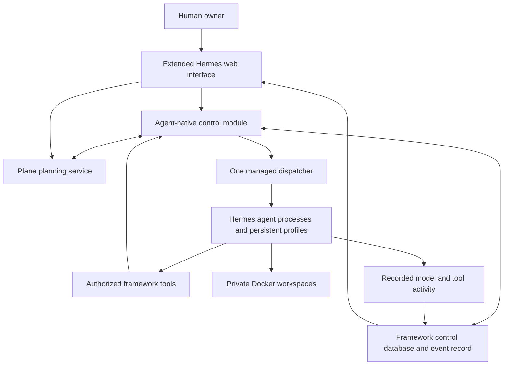

# Implementation plan: a product fork of Hermes

Status: **Hermes fork selected by the owner**, 2026-09-05. This repository is the
framework's implementation home and the First Builder's workspace. The detailed
engineering plan still requires implementation and validation; it is not a claim
of completed work. The [product specification](../design/README.md) remains
authoritative, and proposed defaults do not silently resolve its open decisions.

Development follows the [First Builder startup instructions](../first-builder/INSTRUCTIONS.md)
and [continuous TDD practices](../first-builder/PRACTICES.md). Keep current work
and verification evidence in [STATE.md](../first-builder/STATE.md).

## Recommendation

Build agent-native as a focused fork of Hermes Agent. Reuse its agent engine,
profiles, memory, skills, tools, sandbox backends, dispatcher, and web
interface. Add the persistent organization and human-control rules that make
agent-native a distinct product.

Start with Hermes as the only agent engine. OpenCode is optional future tooling
for a demonstrated specialist need. Prove the first ordinary writer, then the
Builder, on the existing local host with a persistent service, SQLite on local disk and Docker workspaces.
A packaged always-on Linux deployment follows the first handoff. The human's
browser is a client; closing it must not stop work; the runtime host must remain
available.

Allowing a fork makes this simpler than the earlier external-supervisor proposal:
we can change Hermes's execution boundaries directly. Plane supplies planning;
the framework links its records to execution without duplicating the task board. This is still substantial product
work, not a configuration-only setup or a promise of a tiny patch.

## What to read

| Document | Purpose |
| --- | --- |
| [Independent security review milestone](security-review-milestone.md) | Deferred M8 / AN-135: independent reviewers, action gates, behavior audits, scoped containment, owner decisions and adversarial acceptance. |
| [Repository consolidation](repository-consolidation.md) | Proposed one-directory migration, submodule comparison, preservation, cutover checks and rollback; not yet executed. |
| [Agent storage topology](agent-storage-topology.md) | Protected identity, memory, practices, mutable projects, immutable outputs and runtime scratch. |
| [Agent removal](agent-removal.md) | Owner removal, stopped execution and retained history. |
| [Agent model selection](agent-model-selection.md) | Owner defaults, per-agent choices and fixed work/chat attempt selections. |
| [Shared agent work](shared-agent-work.md) | Next refinement: common execution, results and Saved outputs, proven by writer and analyst. |
| [Managed writer run](writer-managed-run.md) | Current bounded native execution, Plane planning, story versions, Pause and limits. |
| [Fantasy-writer milestone](fantasy-writer-milestone.md) | Current cycle: create, chat, observe, save stories and continue; bounded delivery slices. |
| [Activity-without-progress decision](no-progress-detection.md) | AN-67 threshold and response options for the first AN-51 failure-loop detector. |
| [Specification coverage in Plane](plane-roadmap-coverage.md) | Milestone modules, rolling cycle policy and specification/scenario-to-work links; live Plane owns status. |
| [Hermes execution audit](hermes-execution-audit.md) | Pinned upstream/fork baseline, exact patch inventory, native activation map and required managed gates. |
| [Plane project management](plane-project-management.md) | Selected planning service, source ownership, provisioning and integration sequence. |
| [User interface](user-interface.md) | Browser console, Hermes reuse, shared state and incremental UX delivery. |
| [Architecture](architecture.md) | Components, authoritative state, execution, permissions, communication, and recovery. |
| [Delivery plan](delivery-plan.md) | First Builder handoff sequence, M0–M7 capability groups, completion evidence, and all 24 product scenarios. |
| [Decisions and evidence](decisions-and-evidence.md) | Reuse choices, proposed product defaults, source references, and fork maintenance. |

## The application we would build

The control module is ordinary application code within the fork. It checks who
may act and keeps records consistent; it does not choose artistic or commercial
strategy. Agents make those judgments through Hermes's model/tool loop.

## Reuse and custom work

| Capability | Starting point | Our change |
| --- | --- | --- |
| Model calls, tool loop, retries, context management | Hermes engine | Supply trusted agent/run context and enforce run admission. |
| Memory, skills, transcripts | Hermes profiles | Map profiles to stable agent IDs; protect soul and configuration separately. |
| File, shell, browser, domain tools | Hermes and approved MCP integrations | Scope access and credentials; track consequential actions. |
| Sandboxes | Hermes Docker backend | Bind lifetime to framework work, including actual stopping of background processes. |
| Projects, backlog, cycles and board | Plane Community Edition | Provision scoped workspaces and integrate planning operations. |
| Claims, runs, results and evaluations | Framework control module; reuse suitable Hermes primitives | Link Plane items, enforce authority and distinguish submission, assignment acceptance and whole-purpose fulfillment. |
| Recurring activation and dispatch | Hermes gateway and scheduling machinery | Add purpose check-ins; send every activation through one eligibility check. |
| Chat, profile/settings views, task-board UI | Hermes web application | Add agent tree, purpose editor, decision inbox, and connected activity views. |
| Agent ownership and lifecycle | Custom control module | Parent tree, soul revisions, permissions, cancellation with subtree pause, evaluated retirement and replacement; no fixed lifetime types. |
| Clarification and decision routing | Custom records and workflow using existing transports | Parent-by-parent escalation, human-origin authentication, durable returning answers. |
| Observability and progress assessment | Existing execution/task events plus custom records | Unified history, delivery states, freshness, evaluations, and progress concerns. |

Reuse means keeping an existing implementation where it fits, not retaining every
Hermes default. Its peer task access, direct completion, independent activation
paths, and persistent-container cleanup need deliberate changes for this product.
The [evidence review](decisions-and-evidence.md#evidence-and-version-boundaries)
separates documented features from the proposed additions.

## First usable agent, then the Builder handoff

The owner selected an earlier [fantasy-writer milestone](fantasy-writer-milestone.md).
Create a purpose-driven ordinary root, see its real writing activity and saved
stories, converse and steer, then observe it continue on cadence with local restart
recovery. The current cycle delivers that complete experience through shared work and
results. After the first story proof, generalize the existing executor/output
contract and also prove a supplied-material analyst on the same interface; follow
[shared work delivery](shared-agent-work.md) before further writer-specific work. The first
saved story is an intermediate checkpoint, not the full milestone.

The [delivery plan](delivery-plan.md#engineering-sequence-and-evidence) retains M0–M7
as capability groups. Reuse the writer's run/chat/observability/planning foundations
for the subsequent M7 First Builder handoff: protected repository development,
a real TDD improvement and autonomous next work. Do not require Builder repository
privileges, full teams or the complete control center before the writer runs.

Basic authority, actual stopping, root questions, evaluation and recovery belong
in the writer milestone. Enable only its scoped tools and execution paths. The
Builder later adds its protected running-release/repository boundary before it
receives code-editing privileges. Neither milestone is claimed implemented.

## Keep the initial installation small

- One human owner and one trusted web channel.
- One authoritative task store for all projects, with enforced access boundaries.
- One dispatcher; multiple agents and isolated workers as capacity allows.
- Existing Hermes Python and frontend tooling, rather than another backend stack.
- Existing model providers; no custom provider SDK or agent execution loop.
- Standard Docker and service supervision; no Kubernetes or distributed framework
  workflow platform initially. Plane retains its own required service dependencies.
- Plane is the planning store and board. Bundle the project-management skill and
  integrate it with framework control records; do not duplicate a Hermes board.

The owner brought per-agent model/provider selection into the current writer
cycle (AN-27). Recursive teams and authorized communication between separately
isolated workers remain part of the full product specification and follow the
writer and subsequent single-Builder handoff. Multiple physical
worker hosts can follow later; neither the handoff nor the first release depends on them.

## Repository and First Builder workspace

The owner selected `ArturMoczulski/hermes-agent-native` as the implementation home.
The specification and plan now live here. Make active design and implementation
updates in this fork; the old agent-native implementation is reference material.
Do not maintain a compatibility layer for its runtime state, event protocol or
Next.js/NestJS/agentd/OpenCode service chain.

The [First Builder](../first-builder/INSTRUCTIONS.md) develops the framework from
this repository root, following its owner-defined soul and continuous TDD workflow.
It works through the current coding environment now and will run inside the
framework once that capability is implemented. No deployed Builder or scheduler
is established by creating these documents.
