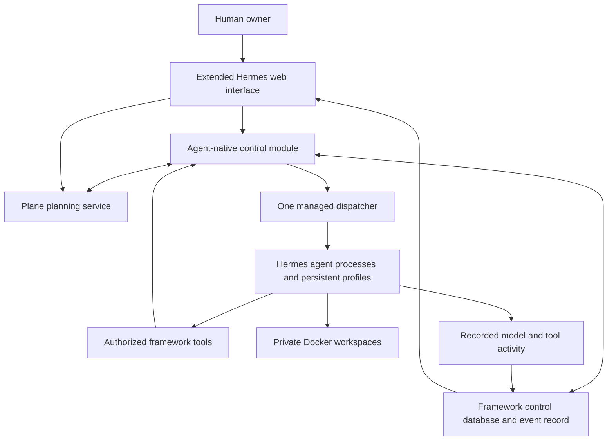

# Implementation plan: a product fork of Hermes

Status: **Hermes fork selected by the owner**, 2026-09-05. This repository is the
framework's implementation home and the First Builder's workspace. The detailed
engineering plan still requires implementation and validation; it is not a claim
of completed work. The [product specification](../design/README.md) remains
authoritative, and proposed defaults do not silently resolve its open decisions.

Development follows the [First Builder startup instructions](../first-builder/INSTRUCTIONS.md)
and [continuous TDD practices](../first-builder/PRACTICES.md). Keep current work
and verification evidence in [STATE.md](../first-builder/STATE.md).

## Recommendation

Build agent-native as a focused fork of Hermes Agent. Reuse its agent engine,
profiles, memory, skills, tools, sandbox backends, dispatcher, and web
interface. Add the persistent organization and human-control rules that make
agent-native a distinct product.

Start with Hermes as the only agent engine. OpenCode is optional future tooling
for a demonstrated specialist need. Prove the first Builder on the existing local
host with a persistent service, SQLite on local disk and Docker workspaces.
A packaged always-on Linux deployment follows the first handoff. The human's
browser is a client; closing it must not stop work; the runtime host must remain
available.

Allowing a fork makes this simpler than the earlier external-supervisor proposal:
we can change Hermes's execution boundaries directly. Plane supplies planning;
the framework links its records to execution without duplicating the task board. This is still substantial product
work, not a configuration-only setup or a promise of a tiny patch.

## What to read

| Document | Purpose |
| --- | --- |
| [Specification coverage in Plane](plane-roadmap-coverage.md) | Milestone modules, rolling cycle policy and specification/scenario-to-work links; live Plane owns status. |
| [Hermes execution audit](hermes-execution-audit.md) | Pinned upstream/fork baseline, exact patch inventory, native activation map and required managed gates. |
| [Plane project management](plane-project-management.md) | Selected planning service, source ownership, provisioning and integration sequence. |
| [User interface](user-interface.md) | Browser console, Hermes reuse, shared state and incremental UX delivery. |
| [Architecture](architecture.md) | Components, authoritative state, execution, permissions, communication, and recovery. |
| [Delivery plan](delivery-plan.md) | First Builder handoff sequence, M0–M7 capability groups, completion evidence, and all 24 product scenarios. |
| [Decisions and evidence](decisions-and-evidence.md) | Reuse choices, proposed product defaults, source references, and fork maintenance. |

## The application we would build

The control module is ordinary application code within the fork. It checks who
may act and keeps records consistent; it does not choose artistic or commercial
strategy. Agents make those judgments through Hermes's model/tool loop.

## Reuse and custom work

| Capability | Starting point | Our change |
| --- | --- | --- |
| Model calls, tool loop, retries, context management | Hermes engine | Supply trusted agent/run context and enforce run admission. |
| Memory, skills, transcripts | Hermes profiles | Map profiles to stable agent IDs; protect soul and configuration separately. |
| File, shell, browser, domain tools | Hermes and approved MCP integrations | Scope access and credentials; track consequential actions. |
| Sandboxes | Hermes Docker backend | Bind lifetime to framework work, including actual stopping of background processes. |
| Projects, backlog, cycles and board | Plane Community Edition | Provision scoped workspaces and integrate planning operations. |
| Claims, runs, results and evaluations | Framework control module; reuse suitable Hermes primitives | Link Plane items, enforce authority and distinguish submission, assignment acceptance and whole-purpose fulfillment. |
| Recurring activation and dispatch | Hermes gateway and scheduling machinery | Add purpose check-ins; send every activation through one eligibility check. |
| Chat, profile/settings views, task-board UI | Hermes web application | Add agent tree, purpose editor, decision inbox, and connected activity views. |
| Agent ownership and lifecycle | Custom control module | Parent tree, soul revisions, permissions, cancellation with subtree pause, evaluated retirement and replacement; no fixed lifetime types. |
| Clarification and decision routing | Custom records and workflow using existing transports | Parent-by-parent escalation, human-origin authentication, durable returning answers. |
| Observability and progress assessment | Existing execution/task events plus custom records | Unified history, delivery states, freshness, evaluations, and progress concerns. |

Reuse means keeping an existing implementation where it fits, not retaining every
Hermes default. Its peer task access, direct completion, independent activation
paths, and persistent-container cleanup need deliberate changes for this product.
The [evidence review](decisions-and-evidence.md#evidence-and-version-boundaries)
separates documented features from the proposed additions.

## The first major milestone: the Builder works inside the framework

The owner wants to continue development through an autonomous First Builder and
its persistent web chat as the first major handoff. M0–M7 remain capability-group
and Plane identifiers; they are not a required numerical delivery order. M7 is
this first handoff gate, supplied by root-relevant M0/M1/M2 work and essential
Builder isolation, without waiting for full M3–M6 delivery.

The [delivery plan](delivery-plan.md#engineering-sequence-and-evidence) expands
this ordered outcome sequence:

1. Finish scoped Plane planning operations and uncertain-write/retry recovery.
2. Run one managed Builder turn with real model, repository-editing and test tools,
   protected soul and running release, authenticated operations, events and Stop.
3. Provide durable owner chat, proactive questions, answers and steering, with
   visible current work and waiting; browser closure does not end the work.
4. Add recurring review, explicit result and purpose evaluation, and basic restart
   reconciliation so the Builder chooses useful work across bounded turns.
5. Prove a real TDD framework improvement, owner steering, browser closure, service
   restart and next authorized work without manually prompting each step.

Then extend to recursive teams, the complete organization monitor and global
inbox, advanced progress assessment, multi-root capacity and packaged Linux
operation. The protected running service must not load changes directly from the
Builder's writable checkout; source access cannot grant authority or deployment
permission. The detailed handoff acceptance is in
[M7](delivery-plan.md#m7--first-major-handoff-the-autonomous-first-builder-with-chat).
These are requirements still to prove, not a claim that the Builder is running.

Basic owner chat, pending decisions, stopping, recovery, result evaluation and
whole-purpose evaluation belong in the first autonomous-root milestone. Completion
of one item does not settle continuing delivery or monitoring obligations. The
agent can initiate controlled retirement after clear whole-purpose fulfillment,
applicable accountable acceptance and resolved obligations; uncertainty follows
the parent chain, with unresolved root questions going to the human. This adds no
blanket human approval requirement. M3 extends the same process to teams and M5
deepens evidence and progress assessment. Later milestones are not permission to
postpone the control foundations.

## Keep the initial installation small

- One human owner and one trusted web channel.
- One authoritative task store for all projects, with enforced access boundaries.
- One dispatcher; multiple agents and isolated workers as capacity allows.
- Existing Hermes Python and frontend tooling, rather than another backend stack.
- Existing model providers; no custom provider SDK or agent execution loop.
- Standard Docker and service supervision; no Kubernetes or distributed framework
  workflow platform initially. Plane retains its own required service dependencies.
- Plane is the planning store and board. Bundle the project-management skill and
  integrate it with framework control records; do not duplicate a Hermes board.

Multiple roots, recursive teams, different models, and authorized communication
between separately isolated workers remain part of the full product specification.
They follow the first single-Builder handoff. Multiple physical worker hosts can
follow later; neither the handoff nor the first release depends on them.

## Repository and First Builder workspace

The owner selected `ArturMoczulski/hermes-agent-native` as the implementation home.
The specification and plan now live here. Make active design and implementation
updates in this fork; the old agent-native implementation is reference material.
Do not maintain a compatibility layer for its runtime state, event protocol or
Next.js/NestJS/agentd/OpenCode service chain.

The [First Builder](../first-builder/INSTRUCTIONS.md) develops the framework from
this repository root, following its owner-defined soul and continuous TDD workflow.
It works through the current coding environment now and will run inside the
framework once that capability is implemented. No deployed Builder or scheduler
is established by creating these documents.
